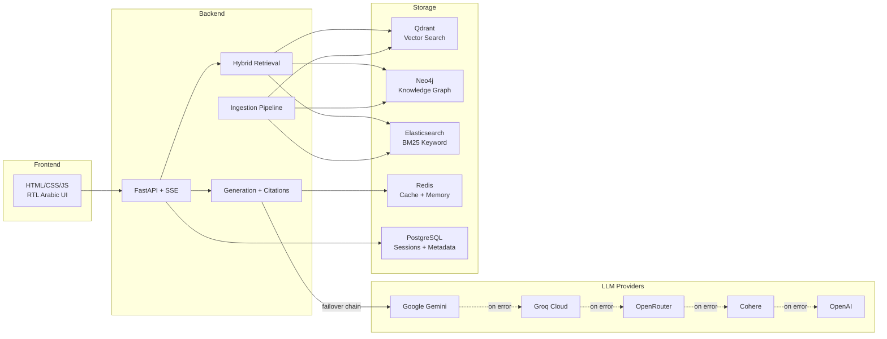
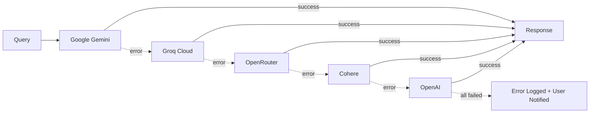
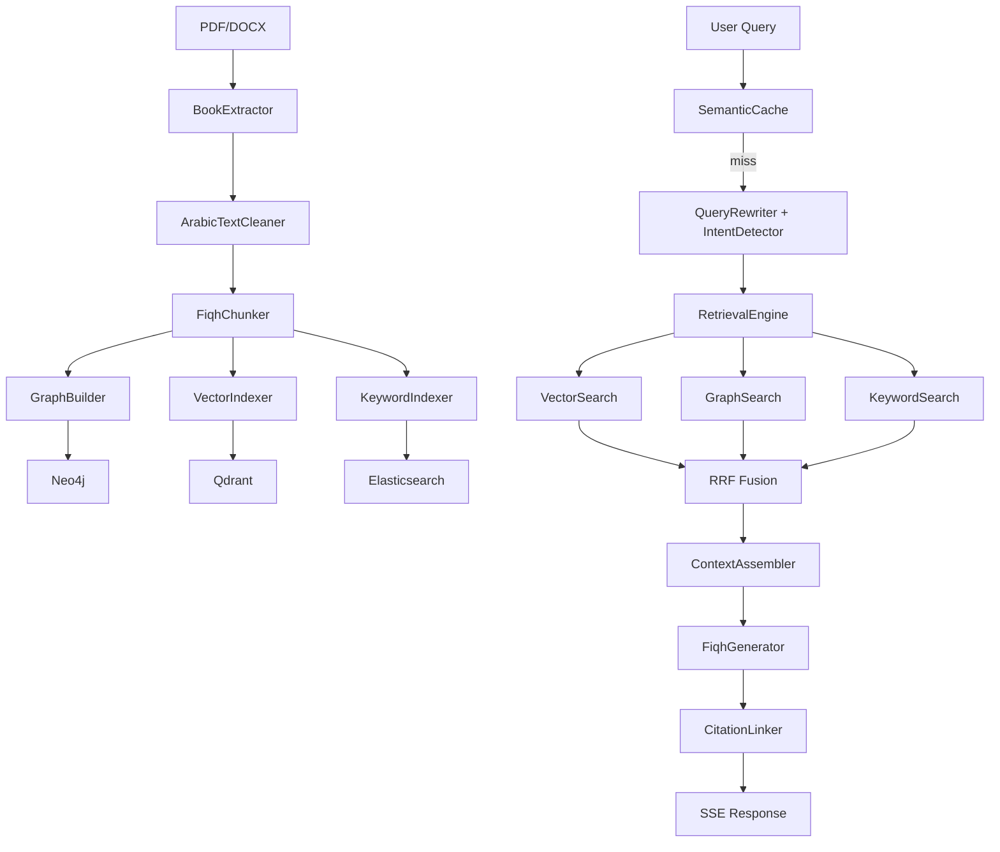

# Faqih.ai

An Islamic Jurisprudence (Fiqh) hybrid RAG system combining vector search, knowledge graphs, and BM25 keyword matching for comprehensive, citation-backed answers across classical Fiqh texts.

## Architecture

### System Overview



### LLM Failover Chain

The system supports multiple LLM providers with automatic failover. If the primary provider fails (quota exceeded, timeout, or any error), the request is transparently retried with the next provider. All failures are logged to `logs/llm_errors.log`.



### End-to-End Pipeline

The system implements a multi-stage pipeline:



**Ingestion Pipeline** — PDF/DOCX extraction → Arabic text cleaning → Fiqh-aware structural chunking → LLM-driven knowledge graph construction → parallel vector (Qdrant) + keyword (Elasticsearch) indexing.

**Query Processing** — HyDE query rewriting → multi-query expansion → intent detection (madhab, question type) → conversation memory with entity tracking.

**Hybrid Retrieval** — Three parallel search paths (dense vector, graph traversal, BM25) fused via Reciprocal Rank Fusion (RRF) with optional cross-encoder reranking.

**Generation** — Context assembly ordered by Fiqh type (hukm → dalil → khilaf → shurut) → LLM streaming with SSE → citation linking.

**Caching** — Four-layer cache: semantic (cosine similarity), embedding (SHA256-keyed), graph result (entity+depth), and async prefetch via Celery.

## Tech Stack

| Layer | Technology |
|-------|-----------|
| API Framework | FastAPI + SSE Streaming |
| Vector Database | Qdrant |
| Graph Database | Neo4j |
| Search Engine | Elasticsearch |
| Cache / Memory | Redis |
| Relational DB | PostgreSQL |
| Embeddings | AraBERT (aubmindlab/bert-base-arabertv2) |
| LLM Providers | Google Gemini, Groq, OpenRouter, Cohere, OpenAI |
| LLM Failover | Automatic chain with error logging |
| Task Queue | Celery |

## Quick Start

```bash
# 1. Clone and install
git clone https://github.com/MohammedHamza0/Faqih.ai.git
cd Faqih.ai
cp .env.example .env  # Add your API keys
pip install -e ".[dev]"

# 2. Start services
docker-compose up -d

# 3. Check health
python scripts/healthcheck.py

# 4. Ingest a book
python scripts/ingest_book.py data/books/your-book.pdf \
    --title "اسم الكتاب" --author "المؤلف" --madhab hanbali

# 5. Start the API
uvicorn src.faqih.api.app:create_app --factory --reload --port 8000

# 6. Start the frontend (in a new terminal)
cd frontend
python -m http.server 3000
# Open http://localhost:3000 in your browser
```

## API Endpoints

| Method | Endpoint | Description |
|--------|----------|-------------|
| POST | `/sessions` | Create a new conversation session |
| POST | `/sessions/{id}/query` | Query with SSE streaming response |
| GET | `/sessions/{id}/history` | Get conversation history |
| GET | `/chunks/{id}` | Get chunk detail for citation cards |
| POST | `/admin/ingest` | Trigger book ingestion (auth required) |
| GET | `/health` | Health check |

## Project Structure

```
src/faqih/
├── config.py              # Pydantic settings
├── models/                # Schemas, enums, ORM
├── ingestion/             # Extract → Clean → Chunk → Graph → Index
├── retrieval/             # Vector + Graph + BM25 → RRF → Rerank
├── generation/            # Context assembly → LLM → Citations
├── memory/                # Redis conversation memory
├── cache/                 # Semantic, embedding, graph, prefetch
├── services/              # Neo4j, Qdrant, ES, Redis, LLM wrappers
├── api/                   # FastAPI routes + dependencies
└── worker/                # Celery task definitions
```

## License

MIT
